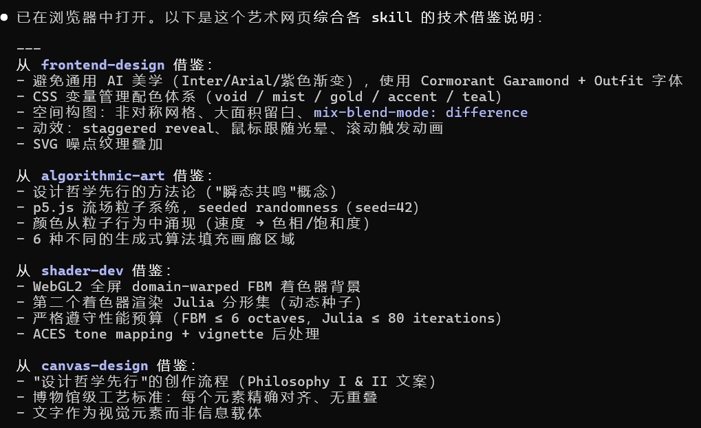

# Skills Develop

A long-term repository for custom Claude Code skills development. Contains self-built skills and showcase projects built by composing multiple skills.

---

## Table of Contents

- [Skills List](#skills-list)
- [Showcase](#showcase)
- [Repository Structure](#repository-structure)
- [How to Use](#how-to-use)

---

## Skills List

| Skill | Path | Description |
|-------|------|-------------|
| skill-router (Codex) | `skill-router_codex/SKILL.md` | Explicit skill router for Codex environments — helps select, compare, and compose skills |
| skill-router (Claude Code) | `skill-router_cc/SKILL.md` | Explicit skill router for Claude Code environments — helps select, compare, and compose skills |

> More skills will be added over time.

---

## Showcase

### Ephemeral Resonance

An interactive visual webpage generated by composing multiple skills: **frontend-design**, **algorithmic-art**, **shader-dev**, and **canvas-design**.



- **File**: `ephemeral-resonance.html`
- **Skills used**: `frontend-design` (layout & styling) + `algorithmic-art` (generative patterns) + `shader-dev` (shader effects) + `canvas-design` (canvas rendering)

---

## Repository Structure

```
skills-develop/
├── README.md                    # This file
├── ephemeral-resonance.html     # Showcase: multi-skill generated webpage
├── 网页生成.png                  # Showcase screenshot
├── skill-router_codex/          # skill-router for Codex
│   └── SKILL.md
├── skill-router_cc/             # skill-router for Claude Code
│   └── SKILL.md
└── ...                          # More skills to be added
```

---

## How to Use

### Installing a Skill

Copy or symlink the skill folder into your local skills directory:

```bash
# For Claude Code
cp -r skill-router_cc/ ~/.claude/skills/

# For Codex
cp -r skill-router_codex/ ~/.codex/skills/
```

### Using skill-router

`skill-router` is an **explicit** skill router — it does NOT intercept all tasks automatically.

**Trigger it when you:**
- Ask "which skill should I use?"
- Say "help me pick a skill"
- Say "list available skills"
- Say "combine multiple skills"
- Have a task that clearly spans multiple skills

**It will NOT trigger when you:**
- Directly name a skill (e.g., `use frontend-design`)
- Have a simple single-domain task
- Just say "build" or "create" without skill selection context

**Example prompts:**

```
Which skill should I use for this task?
Help me combine multiple skills to build a product landing page.
Compare pdf vs docx skill for my current task.
List my local skills and categorize them.
```
